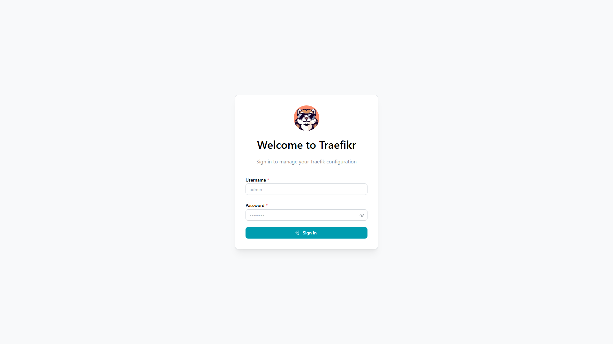
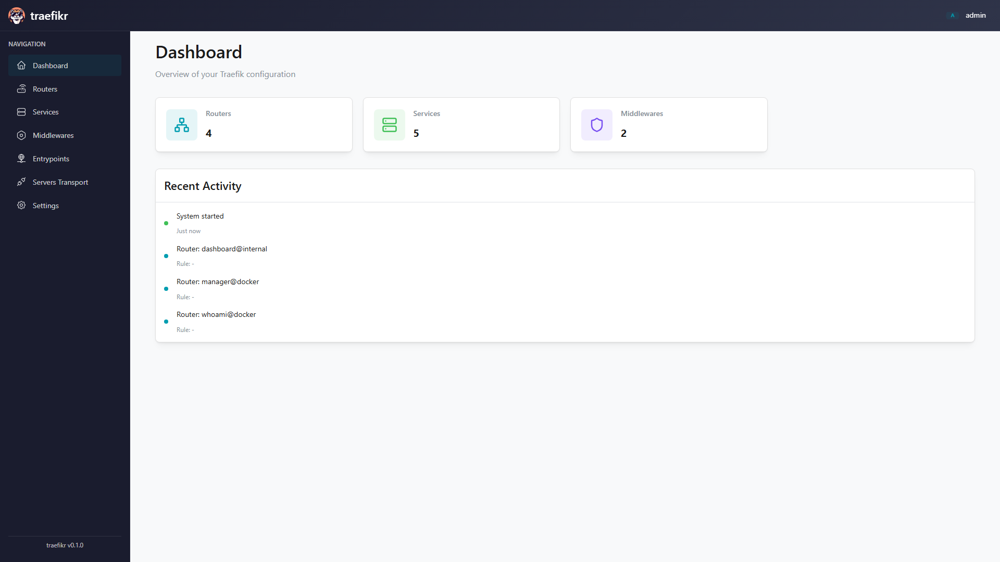
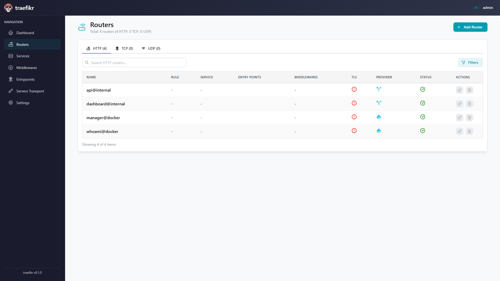
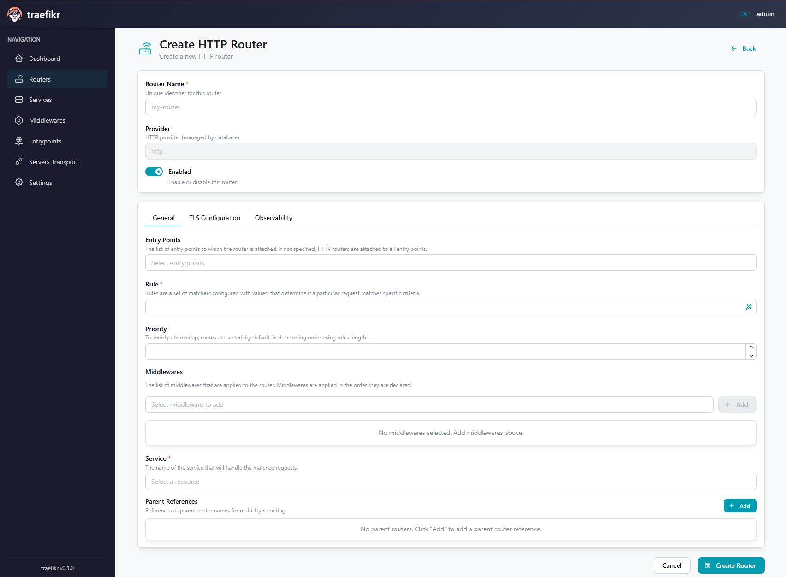
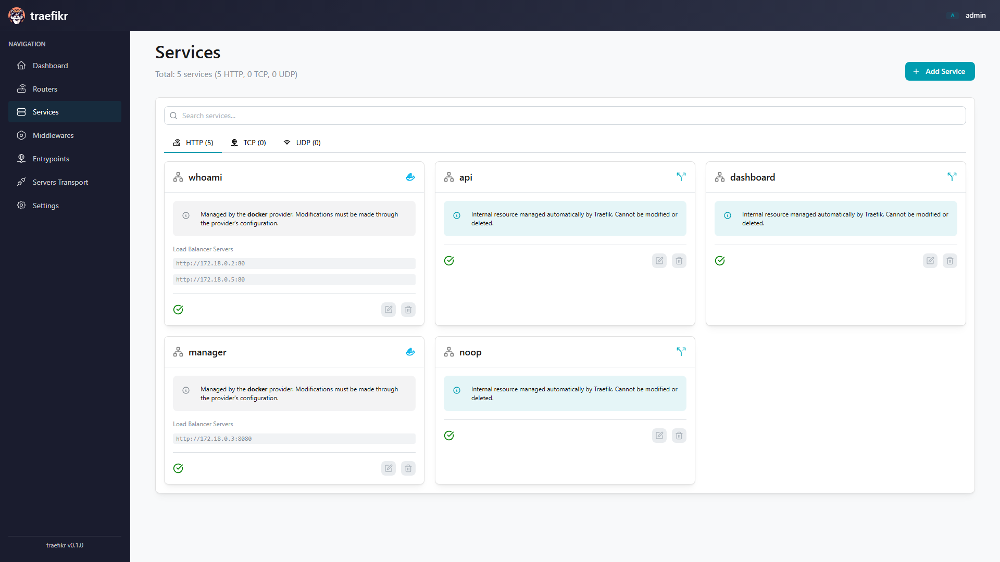
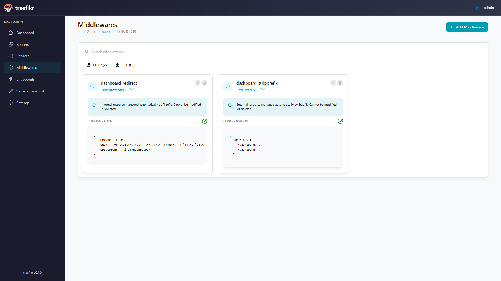
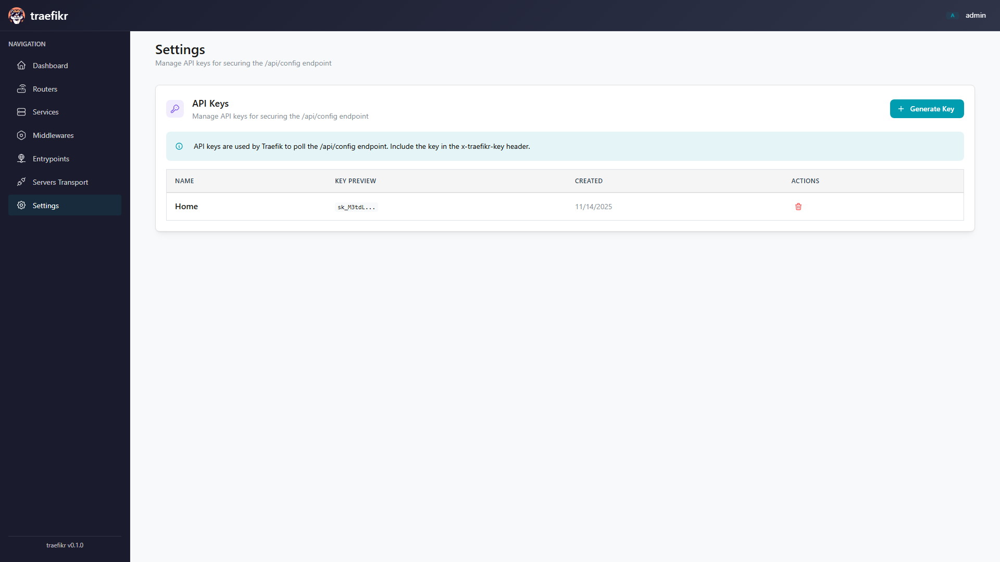
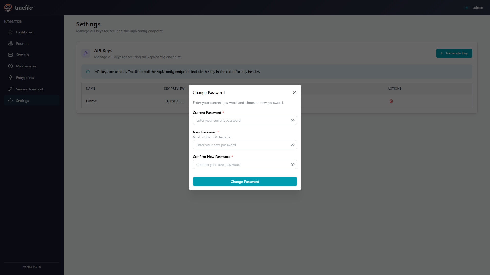

# Traefikr

<p align="center">
  
</p>

<p align="center">
  <strong>Manage your Traefik configurations with ease and confidence</strong>
</p>

<p align="center">
  <a href="#why-traefikr">Why Traefikr</a> •
  <a href="#screenshots">Screenshots</a> •
  <a href="#getting-started">Getting Started</a> •
  <a href="#features">Features</a> •
  <a href="#documentation">Documentation</a>
</p>

---

## Why Traefikr?

Managing Traefik configurations through YAML files can be challenging—tracking changes, validating syntax, and ensuring everything works correctly before deployment. **Traefikr** brings simplicity and confidence to Traefik management with an intuitive web interface that makes configuration feel effortless.

### What Makes Traefikr Special

✨ **Visual Configuration Management** - No more wrestling with YAML syntax. Configure routers, services, and middlewares through beautiful, guided forms that validate your input in real-time.

🛡️ **Built-in Safety** - Every configuration is validated against Traefik v3.6 schemas before being saved. Catch errors before they affect your infrastructure.

⚡ **Instant Updates** - Changes sync with Traefik immediately. No manual reloads or restarts needed.

🎯 **Organized Workspace** - See all your configurations at a glance. Quickly find what you need with search and filtering.

🔐 **Secure by Design** - Enterprise-grade authentication, encrypted passwords, and API key management keep your infrastructure protected.

🚀 **Lightweight & Fast** - The entire application runs in a single ~40MB Docker container. Minimal resource usage, maximum performance.

## Screenshots

### Secure Login
<p align="center">
  
</p>

Start with a secure login. On first launch, Traefikr generates a strong admin password for you.

---

### Dashboard Overview
<p align="center">
  
</p>

Get a complete overview of your Traefik configuration at a glance. Monitor routers, services, and middlewares all in one place.

---

### Router Management
<p align="center">
  
</p>

Create and manage HTTP, TCP, and UDP routers with ease. Visual forms guide you through every option with helpful descriptions.

---

### Smart Configuration Forms
<p align="center">
  
</p>

Intelligent forms with real-time validation make configuration effortless. Every field includes helpful descriptions, and the interface guides you through complex options with ease. No more guessing or checking documentation!

---

### Service Configuration
<p align="center">
  
</p>

Configure load balancers and upstream services effortlessly. Add servers, adjust weights, and configure health checks—all without touching a config file.

---

### Middleware Control
<p align="center">
  
</p>

Set up authentication, rate limiting, headers, and more. Traefikr supports all Traefik middleware types with schema-validated forms.

---

### Settings & API Keys
<p align="center">
  
</p>

Manage API keys for Traefik to pull configurations. Create, view, and revoke keys with a single click.

---

### Change Password
<p align="center">
  
</p>

Keep your account secure by changing your password anytime from the user menu.

---

## Getting Started

### Quick Setup (5 Minutes)

Get Traefikr running in just a few steps:

1. **Clone and start**:
   ```bash
   git clone https://github.com/yourusername/traefikr.git
   cd traefikr
   docker-compose up -d
   ```

2. **Get your admin password**:
   ```bash
   docker-compose logs backend | grep "Password:"
   ```
   You'll see something like:
   ```
   Password: jSmiVnQZ5LL0m-8x
   ```
   **Save this password!** It's shown only once.

3. **Open Traefikr**:
   - Navigate to `http://localhost` (via Traefik)
   - Or `http://localhost:8000` (direct access)
   - Login with username `admin` and your generated password

4. **Start managing your Traefik!**

That's it! You're ready to create routers, services, and middlewares through the beautiful web interface.

### What You Need

- **Docker & Docker Compose** - That's all! Everything else is included.
- **Optional**: Traefik v3.6 if you want to test with a real proxy

## Features

### Complete Resource Management

Traefikr gives you full control over your Traefik configuration:

- **Routers** (HTTP, TCP, UDP) - Route traffic based on hostnames, paths, SNI, and more
- **Services** (HTTP, TCP, UDP) - Configure load balancers and upstream servers
- **Middlewares** (HTTP, TCP) - Add authentication, rate limiting, headers, compression, and more
- **TLS** - Manage certificates and TLS options
- **Server Transports** - Configure how Traefik communicates with backends

### Smart Forms & Validation

Forget memorizing configuration options:

- **Schema-driven forms** automatically show all available options for each resource type
- **Real-time validation** catches errors as you type
- **Helpful descriptions** explain what each option does
- **Intelligent field types** - dropdowns for enums, toggles for booleans, structured inputs for complex objects

### Secure Authentication

Two layers of security protect your infrastructure:

- **User authentication** with JWT tokens for web access
- **API key authentication** for Traefik to poll configurations
- **Password security** with bcrypt hashing (never stored in plain text)
- **Password management** - change your password anytime from the UI
- **Auto-generated credentials** on first launch for immediate security

### Real-time Synchronization

Changes appear instantly:

- Traefik polls Traefikr every 5 seconds for updates
- No manual configuration reloads needed
- See your changes take effect immediately
- Toggle resources on/off without deleting them

### Built for Production

Traefikr is designed to be reliable and secure:

- **Minimal footprint** - ~40MB Docker image from scratch
- **No dependencies** - Fully static binary with embedded frontend
- **SQLite persistence** - All configurations stored reliably
- **CORS protection** and secure headers
- **Battle-tested** Go backend with comprehensive validation

## Configuration

### Connecting Traefik to Traefikr

Tell Traefik where to find Traefikr by adding this to your Traefik static configuration:

```yaml
# traefik.yml
providers:
  http:
    endpoint: "http://backend:8080/api/config"
    pollInterval: "5s"
```

If you've created API keys in Traefikr (Settings page), add authentication:

```yaml
# traefik.yml
providers:
  http:
    endpoint: "http://backend:8080/api/config"
    headers:
      x-traefikr-key: "your-api-key-here"
    pollInterval: "5s"
```

### Environment Variables

Customize Traefikr's behavior with these environment variables:

#### Backend
- `TRAEFIKR_DB_PATH` - Where to store the database (default: `/data/traefikr.db`)
- `TRAEFIKR_PORT` - Port to listen on (default: `8080`)
- `TRAEFIK_API_URL` - Traefik API endpoint (default: `http://traefik:8080`)
- `JWT_SECRET` - JWT signing key (auto-generated if not provided)

#### Frontend
- `VITE_TRAEFIKR_API_URL` - API base URL (default: same-origin)

## How It Works

Traefikr acts as a central configuration hub for Traefik:

```
┌─────────────┐      ┌──────────────┐      ┌─────────────┐
│   Traefik   │─────>│   Traefikr   │<─────│     You     │
│   (Proxy)   │      │   (Manager)  │      │  (Browser)  │
└─────────────┘      └──────────────┘      └─────────────┘
      │                      │
      │                      │
      └──── Polls for configs (every 5s)
                             │
                             └──── Stores in SQLite
```

1. **You configure** routers, services, and middlewares through the web UI
2. **Traefikr validates** and stores your configurations in SQLite
3. **Traefik polls** Traefikr every 5 seconds to check for updates
4. **Changes apply** automatically without restarts

It's that simple!

## API Access

Traefikr provides a complete REST API for automation:

### Authentication
```bash
# Login to get a JWT token
curl -X POST http://localhost:8000/api/auth/login \
  -H "Content-Type: application/json" \
  -d '{"username": "admin", "password": "your-password"}'
```

### Create Resources
```bash
# Create an HTTP router
curl -X POST http://localhost:8000/api/http/routers \
  -H "Authorization: Bearer $JWT_TOKEN" \
  -H "Content-Type: application/json" \
  -d '{
    "name": "my-router",
    "provider": "http",
    "config": {
      "rule": "Host(`example.com`)",
      "service": "my-service@http",
      "entryPoints": ["web"]
    }
  }'
```

### Resource Operations

All resources follow the same intuitive pattern:

```
GET    /api/{protocol}/{type}                    # List all
GET    /api/{protocol}/{type}/{name@provider}    # Get one
POST   /api/{protocol}/{type}                    # Create
PUT    /api/{protocol}/{type}/{name@provider}    # Update
DELETE /api/{protocol}/{type}/{name@provider}    # Delete
```

**Protocols**: `http`, `tcp`, `udp`
**Types**: `routers`, `services`, `middlewares`, `serversTransport`, `tls`

Full API documentation available in [openapi.json](backend/openapi.json).

## Development

Want to contribute or customize Traefikr? We've made it easy!

### Backend Development
```bash
cd backend
go mod download
DB_PATH=./traefikr.db PORT=8080 go run main.go
```

### Frontend Development
```bash
cd frontend
npm install
npm run dev
```

### Build Production Image
```bash
docker-compose build
```

See [CLAUDE.md](CLAUDE.md) for detailed technical documentation.

## Roadmap

We're constantly improving Traefikr. Here's what's coming:

- [ ] Multi-user management with role-based access
- [ ] Configuration import/export (backup & restore)
- [ ] Configuration templates for common setups
- [ ] Multi-instance Traefik support
- [ ] Monitoring dashboard with metrics
- [ ] Audit logging for compliance
- [ ] Dark mode (because why not?)

## Support

Having trouble? We're here to help!

- **Documentation**: Check [CLAUDE.md](CLAUDE.md) for technical details
- **Issues**: Report bugs on [GitHub Issues](https://github.com/yourusername/traefikr/issues)
- **Discussions**: Ask questions in [GitHub Discussions](https://github.com/yourusername/traefikr/discussions)

## Contributing

We love contributions! Whether it's:

- 🐛 Bug reports
- 💡 Feature suggestions
- 📝 Documentation improvements
- 🔧 Code contributions

Check out our [Contributing Guide](CONTRIBUTING.md) to get started.

## License

Traefikr is open source software licensed under the [MIT License](LICENSE). Use it, modify it, share it!

## Acknowledgments

Built with amazing open source tools:

- **[Traefik](https://traefik.io/)** - The incredible reverse proxy that makes all this possible
- **[Mantine](https://mantine.dev/)** - Beautiful React components that make the UI shine
- **[Gin](https://gin-gonic.com/)** - Fast and elegant Go web framework
- **[SQLite](https://sqlite.org/)** - Reliable, embedded database

---

<p align="center">
  <strong>Ready to simplify your Traefik management?</strong><br>
  <code>docker-compose up -d</code> and you're on your way!
</p>

<p align="center">
  Made with ❤️ for the Traefik community
</p>
